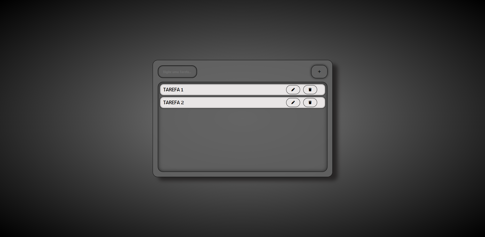

<h1>To-Do-List</h1>

Um aplicativo simples e estilizado de lista de tarefas feito em HTML, CSS e JavaScript puro.
Permite adicionar, editar e excluir tarefas, com armazenamento no LocalStorage para manter os dados mesmo após fechar o navegador.

<h1>Demonstração</h1>

A primeira visão do site:

Após adicionar tarefas:

Link para o github pages do projeto: https://victorsiger.github.io/To-Do-List

<h1>Tecnologias utilizadas</h1>

 

     

<h1>Autor</h1>
Victor Oliveira 
[Github:](https://github.com/VictorSiger) 
[LinkedIn](https://www.linkedin.com/in/victor-hugo-regis)
          
